# MITO Engine v1.2.0 - Complete System Architecture Flow

```mermaid
graph TB
    subgraph "User Interface Layer"
        UI[MITO Dashboard] --> GW[Giant Workbench]
        UI --> CE[Code Editor & Flow Designer]
        UI --> MW[Mobile Workbench]
        UI --> WB[Interactive Whiteboard]
        UI --> MM[Memory Manager]
    end

    subgraph "Core AI Engine"
        MITO[MITO Autonomous Agent]
        MITO --> TQ[Task Queue Manager]
        MITO --> DM[Decision Making Engine]
        MITO --> WM[Weight Management System]
        
        subgraph "AI Providers"
            OPENAI[OpenAI GPT-3.5/DALL-E 3]
            LLAMA[LLaMA 3 70B via Groq]
            CLAUDE[Claude 3 Opus]
            LOCAL[Local Fallback Generator]
        end
        
        MITO --> OPENAI
        MITO --> LLAMA
        MITO --> CLAUDE
        MITO --> LOCAL
    end

    subgraph "Memory & Knowledge System"
        DB[(PostgreSQL Database)]
        MEM[Memory Manager]
        KB[Knowledge Base]
        FS[File System]
        
        MEM --> DB
        KB --> FS
        MITO --> MEM
        MITO --> KB
    end

    subgraph "Processing Pipeline"
        REQ[Request Processor] --> AI_GEN[AI Generation Engine]
        AI_GEN --> CODE_GEN[Code Generator]
        AI_GEN --> IMG_GEN[Image Generator]
        AI_GEN --> TEXT_GEN[Text Generator]
        
        subgraph "File Processing"
            UPLOAD[File Upload Handler]
            ANALYZER[Content Analyzer]
            EXTRACTOR[Text Extractor]
        end
        
        UPLOAD --> ANALYZER
        ANALYZER --> EXTRACTOR
        EXTRACTOR --> KB
    end

    subgraph "Notification & Monitoring"
        NM[Notification Manager]
        API_TRACK[API Usage Tracker]
        HEALTH[Health Monitor]
        
        NM --> UI
        API_TRACK --> NM
        HEALTH --> NM
        MITO --> NM
    end

    subgraph "Security & Admin"
        AUTH[Admin Authentication]
        SEC[Security Core]
        CONFIG[Configuration Manager]
        
        AUTH --> UI
        SEC --> MITO
        CONFIG --> MITO
    end

    subgraph "Advanced Features"
        PHASE[Phase Manager]
        COLLAB[Live Collaboration]
        TEMPLATE[Project Templates]
        DEPLOY[Deployment Manager]
        
        PHASE --> MITO
        COLLAB --> UI
        TEMPLATE --> CODE_GEN
        DEPLOY --> FS
    end

    %% Data Flow Connections
    UI --> REQ
    REQ --> MITO
    MITO --> TQ
    TQ --> AI_GEN
    
    %% Feedback Loops
    AI_GEN --> MEM
    CODE_GEN --> FS
    IMG_GEN --> FS
    
    %% Monitoring Connections
    OPENAI --> API_TRACK
    LLAMA --> API_TRACK
    CLAUDE --> API_TRACK
    
    %% Weight Management
    WM --> OPENAI
    WM --> LLAMA
    WM --> CLAUDE
    WM --> LOCAL

    %% Styling
    classDef userInterface fill:#4a90e2,stroke:#fff,stroke-width:2px,color:#fff
    classDef coreEngine fill:#e74c3c,stroke:#fff,stroke-width:2px,color:#fff
    classDef aiProvider fill:#27ae60,stroke:#fff,stroke-width:2px,color:#fff
    classDef memory fill:#9b59b6,stroke:#fff,stroke-width:2px,color:#fff
    classDef processing fill:#f39c12,stroke:#fff,stroke-width:2px,color:#fff
    classDef security fill:#34495e,stroke:#fff,stroke-width:2px,color:#fff
    classDef advanced fill:#1abc9c,stroke:#fff,stroke-width:2px,color:#fff

    class UI,GW,CE,MW,WB,MM userInterface
    class MITO,TQ,DM,WM coreEngine
    class OPENAI,LLAMA,CLAUDE,LOCAL aiProvider
    class DB,MEM,KB,FS memory
    class REQ,AI_GEN,CODE_GEN,IMG_GEN,TEXT_GEN,UPLOAD,ANALYZER,EXTRACTOR processing
    class AUTH,SEC,CONFIG security
    class PHASE,COLLAB,TEMPLATE,DEPLOY advanced
```

## System Flow Description

### 1. User Interaction Layer
- **MITO Dashboard**: Central command interface
- **Giant Workbench**: Unified development environment
- **Code Editor**: Live coding with Mermaid flow support
- **Mobile Workbench**: Mobile-optimized interface
- **Interactive Whiteboard**: Visual collaboration space

### 2. Core AI Engine (MITO Agent)
- **Autonomous Agent**: Central decision-making AI
- **Task Queue**: Priority-based task execution
- **Decision Engine**: Smart provider switching and optimization
- **Weight Management**: Dynamic capability tuning

### 3. AI Provider Integration
- **OpenAI**: GPT-3.5 for text, DALL-E 3 for images
- **LLaMA 3**: 70B model via Groq for advanced reasoning
- **Claude 3**: Opus model for complex analysis
- **Local Fallback**: Ensures system always responds

### 4. Memory & Knowledge System
- **PostgreSQL Database**: Persistent memory storage
- **Memory Manager**: Context-aware memory operations
- **Knowledge Base**: File-based learning system
- **File System**: Project and asset management

### 5. Processing Pipeline
- **Request Processor**: Unified request handling
- **AI Generation**: Multi-modal content creation
- **File Processing**: Upload, analysis, and knowledge extraction

### 6. Monitoring & Notifications
- **Real-time Notifications**: System alerts and updates
- **API Usage Tracking**: Cost monitoring and optimization
- **Health Monitoring**: System performance tracking

### 7. Security & Administration
- **Admin Authentication**: Secure access control
- **Security Core**: System protection and validation
- **Configuration Management**: Dynamic system tuning

### 8. Advanced Features
- **Phase Manager**: Project lifecycle management
- **Live Collaboration**: Real-time multi-user editing
- **Project Templates**: Rapid deployment scaffolding
- **Deployment Manager**: Production deployment automation

## Key System Characteristics

### Autonomous Operation
MITO operates independently, making decisions about:
- API provider selection based on cost and performance
- Task prioritization and execution
- System optimization and maintenance
- Proactive user assistance

### Multi-Modal Capabilities
- Text generation and analysis
- Image creation and processing
- Code generation and optimization
- File analysis and knowledge extraction

### Learning & Adaptation
- Memory system learns from interactions
- Weight management adapts to usage patterns
- Knowledge base grows with uploaded content
- Performance optimization based on feedback

### Production Ready
- Comprehensive error handling and fallbacks
- Security-first architecture
- Scalable component design
- Professional documentation and verification