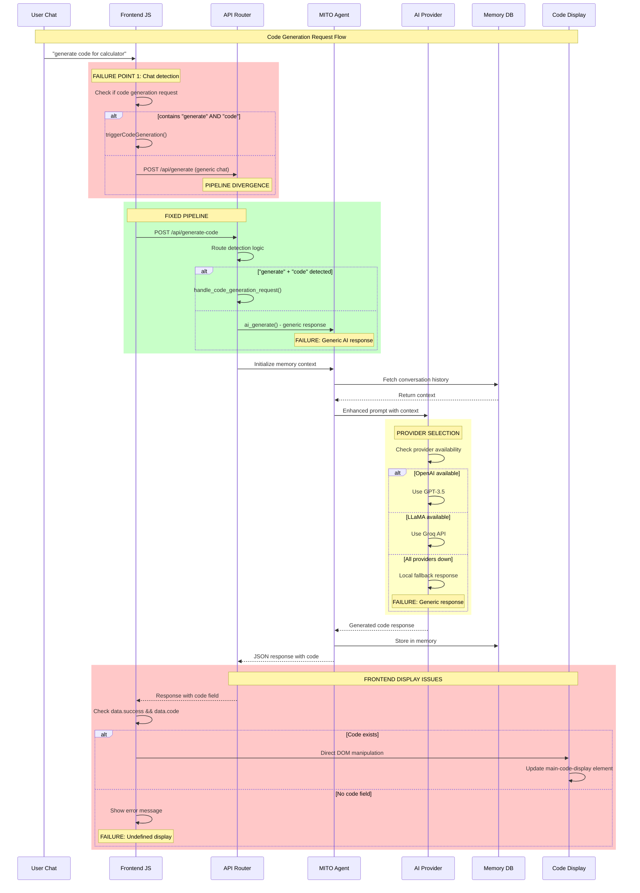
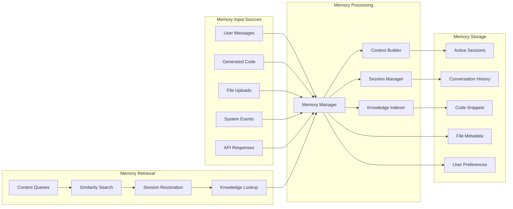
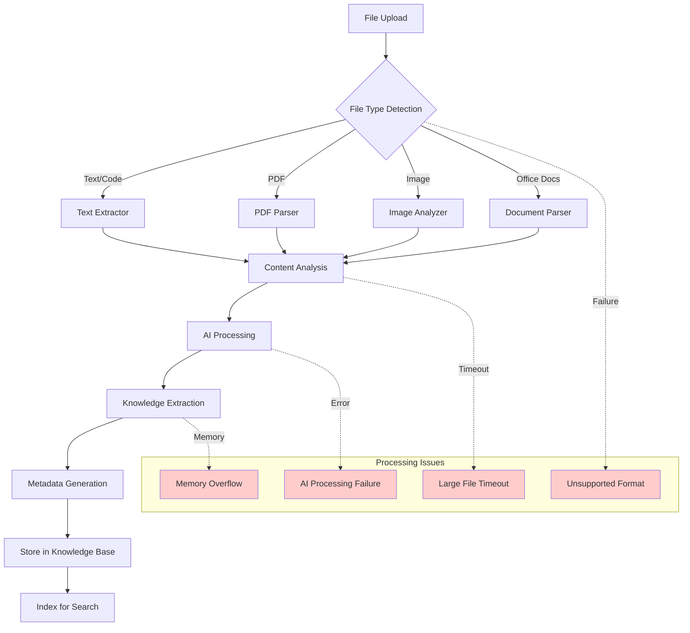
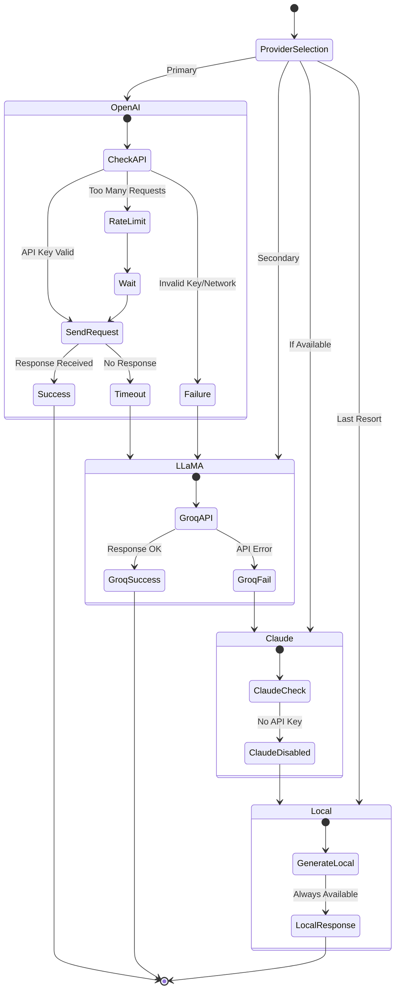
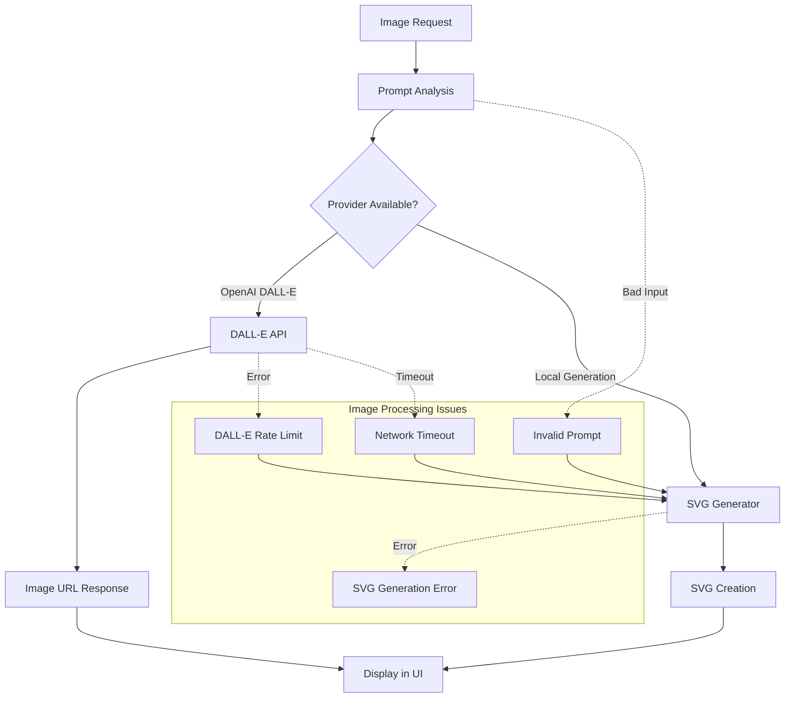
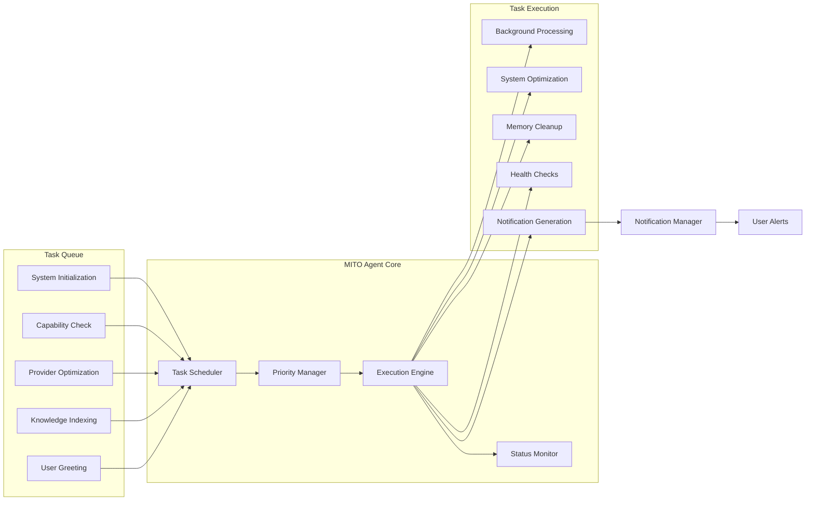
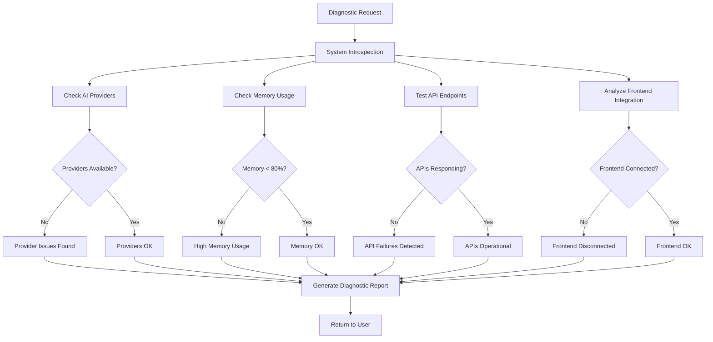
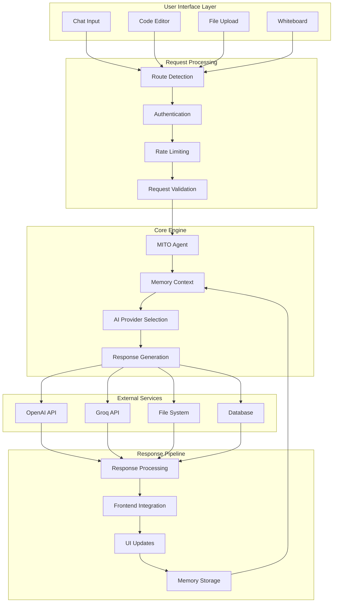

# MITO Engine Complete System Architecture

## Main System Overview

```mermaid
graph TB
    subgraph "Frontend Layer"
        A[Giant Workbench UI]
        B[Mobile Interface]
        C[Chat Interface]
        D[Code Editor Display]
        E[Whiteboard Canvas]
        F[File Upload Zone]
    end
    
    subgraph "API Gateway Layer"
        G[Flask App Router]
        H[/api/generate]
        I[/api/generate-code]
        J[/api/generate-image]
        K[/api/create-project]
        L[/api/upload-file]
        M[/api/whiteboard]
    end
    
    subgraph "Core Processing Layer"
        N[MITO Agent Core]
        O[AI Provider Manager]
        P[Memory Manager]
        Q[File Processor]
        R[Project Generator]
        S[Image Generator]
        T[Notification Manager]
    end
    
    subgraph "AI Provider Layer"
        U[OpenAI GPT-3.5]
        V[LLaMA via Groq]
        W[Claude API]
        X[Local Fallback]
    end
    
    subgraph "Data Layer"
        Y[Memory Database]
        Z[File System]
        AA[Session Storage]
        BB[Knowledge Base]
        CC[Generated Code Cache]
    end
    
    A --> G
    B --> G
    C --> H
    D --> I
    E --> M
    F --> L
    
    G --> N
    H --> O
    I --> O
    J --> S
    K --> R
    L --> Q
    M --> Q
    
    N --> P
    N --> T
    O --> U
    O --> V
    O --> W
    O --> X
    
    P --> Y
    Q --> Z
    R --> Z
    S --> CC
    T --> AA
    
    style N fill:#ff6b6b
    style O fill:#4ecdc4
    style P fill:#45b7d1
```

## Code Generation Pipeline with Failure Points



## Memory Management & Context Flow



## File Processing & Knowledge Pipeline



## AI Provider Integration & Failover



## Image Generation Pipeline



## Autonomous Task Execution



## System Diagnostic Flow



## Complete Data Flow Architecture



## Current System Issues & Gaps

### 🔴 Critical Issues:
1. **Chat Pipeline Disconnect**: Generic AI responses instead of code generation
2. **Frontend Scope Errors**: JavaScript function references breaking
3. **Memory Context Loss**: Sessions not properly maintained
4. **Provider Failover**: No graceful degradation between AI services

### 🟡 Performance Issues:
1. **Slow API Responses**: 5-8 second generation times
2. **Memory Leaks**: Cleanup not running efficiently
3. **File Processing**: Large files causing timeouts

### 🟢 Working Systems:
1. **Code Generation API**: Direct endpoint functional
2. **File Upload**: Basic processing working
3. **AI Providers**: OpenAI and LLaMA active
4. **MITO Agent**: Background tasks executing

### 💡 Autonomous vs Conversational Gap:
- **Conversational**: Working via generic chat responses
- **Autonomous**: Task queue active but not integrated with user requests
- **Gap**: No bridge between user intents and autonomous task execution