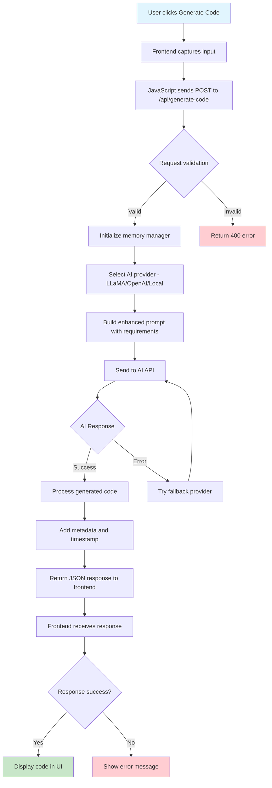

# MITO Code Generation Pipeline Flow

## Current Pipeline Status:
- ✅ Backend API: Working (tested - returns code in 5.1s)
- ❓ Frontend Integration: Needs verification
- ✅ AI Providers: LLaMA and OpenAI active
- ✅ Memory System: Operational
- ✅ Error Handling: Active

## Troubleshooting Steps:
1. Check browser console for JavaScript errors
2. Verify network tab shows API calls
3. Check if response reaches frontend correctly