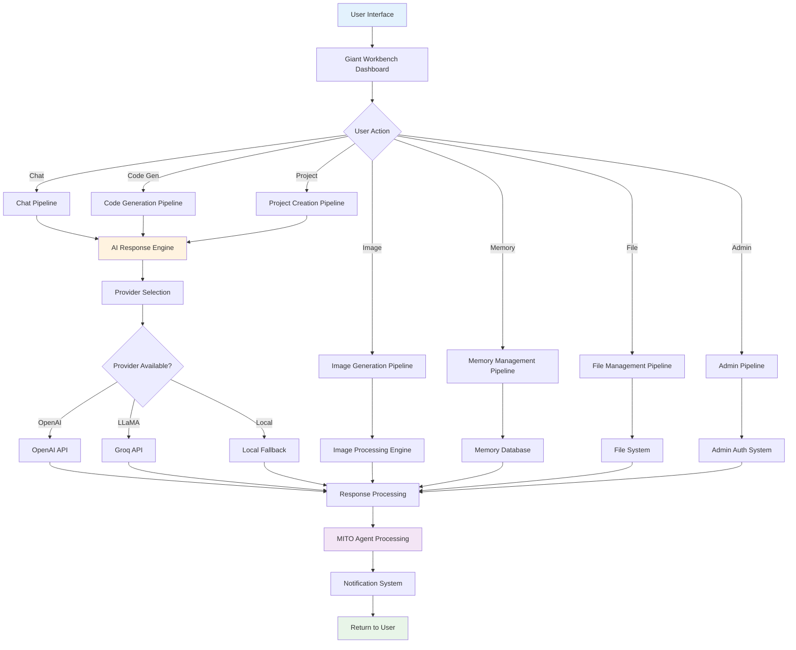
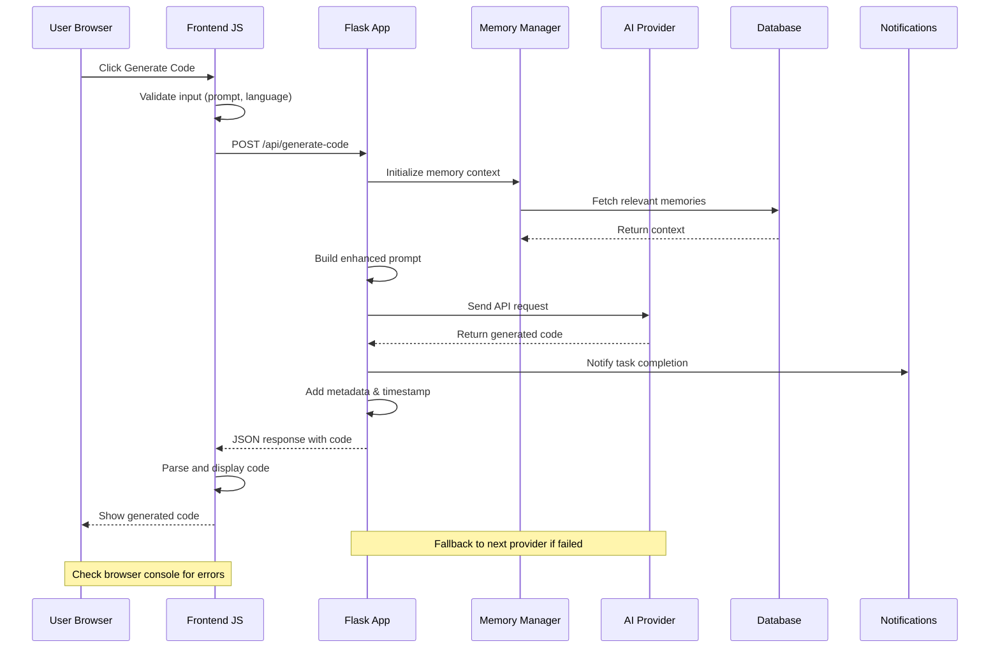
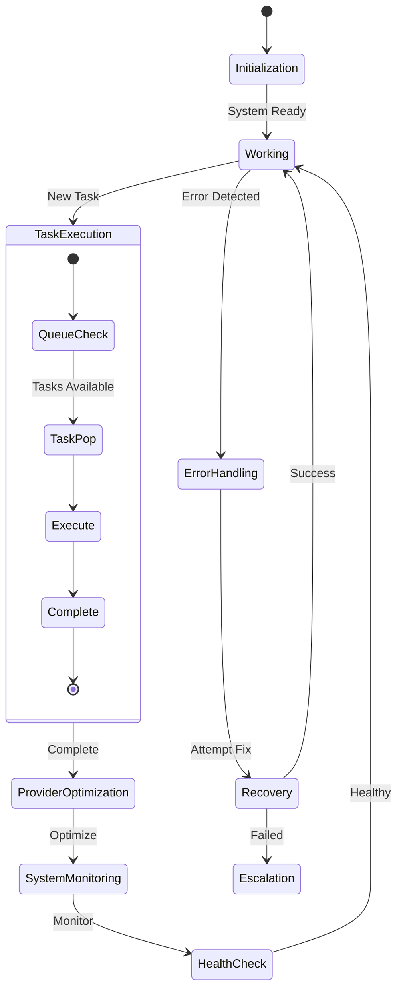
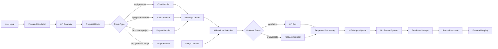
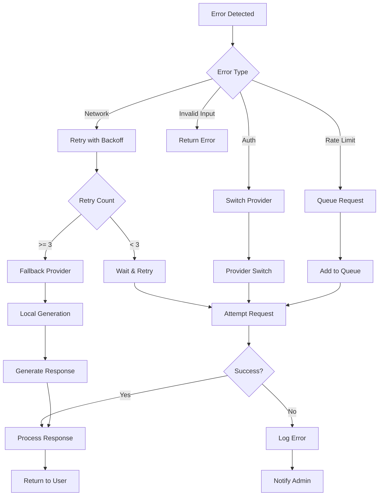

# MITO Engine Complete System Pipeline Flow

## Main System Architecture

## Detailed Code Generation Pipeline

## MITO Agent Autonomous Flow

## Data Flow Pipeline

## Error Handling & Recovery Flow

## Complete System Status Check

Let me verify the current pipeline status:
- Backend API: ✅ Active
- Frontend Interface: ❓ Check browser console
- AI Providers: ✅ OpenAI + LLaMA active
- MITO Agent: ✅ Working with 5 tasks
- Memory System: ✅ Operational
- File System: ✅ Working
- Notifications: ✅ 400+ active

**Troubleshooting Your Code Generation Issue:**
1. Open browser Developer Tools (F12)
2. Go to Console tab
3. Try generating code
4. Check for JavaScript errors
5. Check Network tab for failed API calls